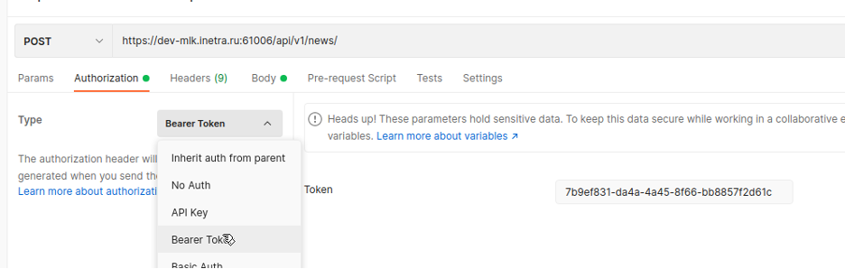
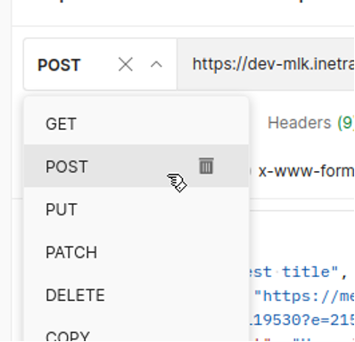
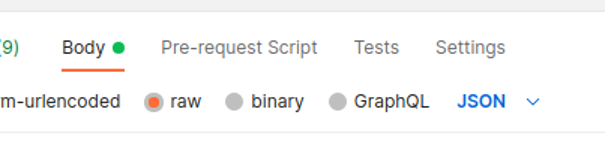
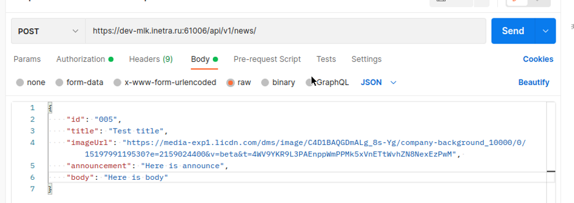
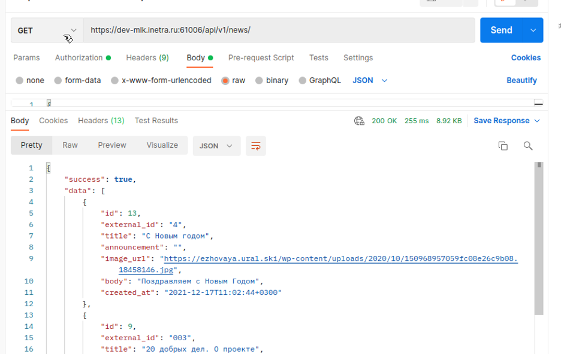
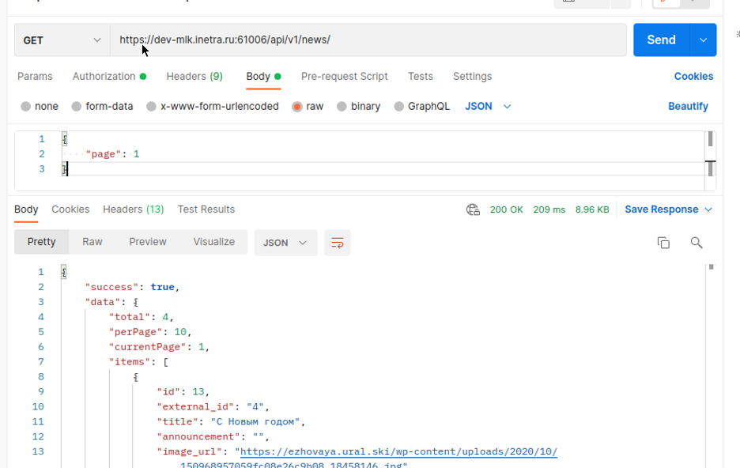
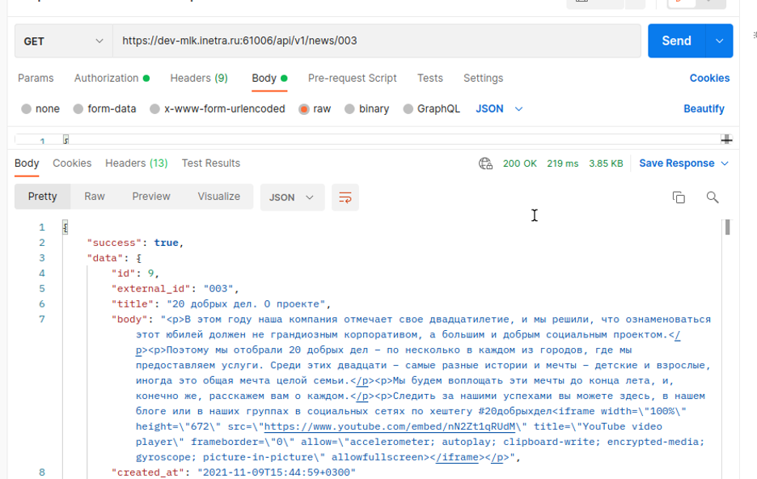

# Описание внешних API МЛК

> [!warning]
> Документация соответствует МЛК версии 26.2

## Общие положения

Все API работают про принципу REST, и аутентицируются по ключу, настраиваемому на стороне бекенда (переменная `OPERATOR_TOKEN` из env-файла docker compose).

Смена ключа требует также перевыпуска мобильных приложений. Это поведение будет исправлено в дальнейшем (задача UMLK-1552).

Все запросы должны отправляться с заголовками:

```
Content-Type: application/json
Authorization: Bearer OPERATOR_TOKEN
```

В качестве `OPERATOR_TOKEN` нужно подставить указанное в env-файле бекенда значение.

Внешнее API позволяет:

* управлять уведомлениями, включая отправку и просмотр состояния
* управление каталогом товаров
* управление новостями из одноименного раздела

### Утилита для работы с API

Для работы с API рекомендуется использовать утилиту [Postman](https://www.postman.com/).

В качестве инструкции, как работать с данным инструментом, можно использовать статью на Тпрогер: https://tproger.ru/articles/gajd-po-rabote-s-postman

Во всех запросах API используется Bearer Token:



Далее указать метод и вписать запрос:



Тело запроса (для запросов, изменяющих данные) всегда передается в JSON. Для этого на вкладке "Body" нужно указать:



Внешний вид Postman может отличаться от версии к версии, но смысл остается прежним.

## Управление уведомлениями

### Получение срока хранение уведомлений

Запрос: 
```
GET /api/v1/notifications/interval/old
```

Возвращает текущее время хранения уведомлений на сервере.

```json
{
    "success": true,
    "data": "5 days",
    "code": 200
}
```

### Установка срока хранения уведомлений

Запрос:
```
PUT /api/v1/notifications/interval/old
```

Тело запроса 
```json
{
    "interval": "30 days"
}
```

Устанавливает время хранения уведомлений (в терминах интервалов времени postgres) на бекенде.

Успешный ответ:
```json
{
    "success": true,
    "code": 200
}
```

### Отправка уведомления

Запрос:
```
POST /api/v1/notifications/send
```

Тело запроса
```json
{
    "subscriber": "...",
    "title": "title",
    "body": "body",
    "data": {
        "type": "balance_up"
    }
}
```

В поле `subscriber` передается код абонента. При отсутствии данного поля в запросе уведомление
отправится всем абонентам, вошедшим в МЛК.

В поле `type` передается тип уведомления. Доступные типы уведомлений:
* `balance_up` - пополнение баланса: при нажатии на уведомление приложение открывает экран пополнения баланса
* `other` - все остальные уведомления, приложение переходит на экран со списком уведомлений

Если у абонента не установлен МЛК, или абонента с таким кодом не существует, то вернется HTTP статус код 404
и ошибка в ответе такого вида:

```json
{
    "success": false,
    "message": "Subscribers not found",
    "code": 404
}
```

Успешный ответ содержит поле data — массив, заполненный для каждого абонента получателя созданных уведомлений:

```json
{
    "success": true,
    "data": [{
        "id": 1,
        "subscriber": "...",
        "title": "title",
        "body": "body",
        "type": "balance_up",
        "status": "pending",
        "created_at": "2020-11-11T11:20:19+0700"
    }],
    "message": "success",
    "code": 200
}
```

## Отслеживание статуса уведомления

Запрос:
```
GET /api/v1/notifications/<id>
```

Возвращает информацию о конкретном уведомлении в формате:

```json
{
    "success": true,
    "data": {
        "id": 1,
        "subscriber": "...",
        "title": "title",
        "body": "body",
        "type": "balance_up",
        "status": "pending",
        "created_at": "2020-11-11T11:20:19+0700"
    },
    "message": "success",
    "code": 200
}
```

Полный жизненный цикл уведомления такой: `pending` &rarr; `delivered` &rarr; `read`.

* `pending` — уведомление отправлено, но не получено ни одним из устройств абонента
* `delivered` — уведомление получено хотя бы одним из устройств абонента
* `read` — уведомление прочитано хотя бы на одном из устройтсв абонента


## Управление новостями

### Создание новости

Запрос:
```
POST /api/v1/news/
```

> [!note] Идентификатор новости
> Обратите внимание, что при создании новости в поле `id` необходимо передавать внешний по отношению к МЛК, сгенерированный вами идентификатор новости, по данному `id` новость будет доступна в остальных запросах.
>
> Это может быть как случайная строка, так и идентификатор генерируемый третьей стороной.

Тело запроса:
```json
{
    "id": "123",
    "title": "заголовок новости, обязательное поле", 
    "imageUrl": "https://... ссылка на изображение новости, необязательное поле",
    "announcement": "анонс новости, необязательное поле",
    "body": "тело новости, обязательное поле"
}
```

Например:



Пример ответа:
```json
{
    "success": true,
    "data": {
        "post": {
            "id": 73,
            "external_id": "001",
            "title": "News Post 001 Title",
            "announcement": "Announcement of post - it is short content",
            "image_url": "https://static.news.ru/photo/thunk_859.jpg",
            "body": "Body of the post.",
            "created_at": "2021-09-27T09:48:55+0300"
        },
        "notification_result": "Notifications sended."
    },
    "message": "success",
    "code": 200
}
```

> [!note] Отправка уведомлений о новости
> 
> При создании новости всем пользователям отправляется push-уведомление - в заголовок уведомления передается `title` и `announcement`, если указан.

> [!note] Рекомендация по верстке body
> 
> Верстка должна быть без тегов `html` и `body`, контент может быть в `div`. 
> Обратите внимание, что для корректного отображения в приложении, ширина у тэга `iframe` YouTube и опросника Google должна быть 100%. Высоту фреймов оставлять стандартной, как предоставляет генератор.


### Получение списка всех новостей

Запрос:
```
GET /api/v1/news/ 
```

Возвращает все новости одним списком, пример вывода:



Если при это запросе передать числовое значение в параметре `page`

```json
{
    "page": 1
}
```

то будет выведена только первая страница списка новостей (на одной странице не более 10 новостей):




### Получение конкретной новости по внешнему (вашему) идентификатору

Запрос:
```
GET /api/v1/news/<external_id>
```

В качестве идентификатора используем тот, что использовался при создании новости. В методе получения списка новостей данный идентификатор называется `external_id`.




### Обновление новости по внешнему (вашему) идентификатору

Запрос:
```
PUT /api/v1/news/<external_id>
```

При обновлении новости можно указать параметры:

```json
{
    "title": "измененный заголовок новости, необязательное поле",
    "imageUrl": "измененная ссылка на изображение новости, необязательное поле",
    "announcement": "измененный анонс новости, необязательное поле",
    "body": "измененное тело новости, обязательное поле",
}
```

Ответ:
```json
{
    "success": true,
    "data": {
        "id": 75,
        "external_id": "003",
        "title": "News Post 003 Title WITH CHANGED TITLE",
        "announcement": "CHANGED Announcement of post - it is short content",
        "image_url": "https://static.news.ru/photo/thunk_859.jpg",
        "body": "CHANGED Body of the post.",
        "created_at": "2021-09-27T09:51:53+0300",
        "updated_at": "2021-09-27T09:59:18+0300"
    },
    "message": "success",
    "code": 200
}
```

Пример:


> [!warning] Изменение внешнего идентификатора
> 
> Внешний идентификатор не может быть изменен после создания новости.

### Удаление новости по внешнему (вашему) идентификатору

Запрос:
```
DELETE /api/v1/news/<external_id>
```

Ответ при успешном выполнении:
```json
{
    "success": true,
    "code": 200
}
```

## Управление магазином

### Получение списка категорий

Запрос
```
GET /api/v1/sales/category/
```

### Добавление категории

Запрос:
```
POST /api/v1/sales/category
```

JSON тело запроса:
```json
{
   "category": "Интернет",
   "imageUrl": "https://w7.pngwing.com/pngs/1022/876/png-transparent-computer-icons-internet-world-wide-web-symmetry-earth-internet.png",
   "type":"type_inet" 
}
```

| Параметр   | Смысл |
|------------|-------|
| `category` | Наименование категории, которое отображается в приложении |
| `imageUrl` | Иконка для категории, которая отображается в МЛК |
| `type`     | тип категории |

Каждой категории соответствует определенный тип:

| Категория | Тип |
|-----------|-----|
| `base_packages` | `base_packages` |
| `Интернет` | `type_inet` |
| `Цифровое ТВ` | `type_tv` |
| `Видеосервис` | `type_video` |
| `Оборудование` | `type_installation` |
| `Кабельное ТВ` | `type_cable` |
| `Домофон` | `type_intercom` |
| `Охрана` | `type_security` |
| `Видеоконтроль` | `type_control` |
| `Умный дом` | `type_smart` |

Пример успешного ответа
```json
{
   "success": true,
   "data": {
       "categories": {
           "id": 2,
           "category": "Интернет",
           "image_url": "https://w7.pngwing.com/pngs/1022/876/png-transparent-computer-icons-internet-world-wide-web-symmetry-earth-internet.png",
           "type": "type_inet"
       }
   },
   "message": "success",
   "code": 200
}
```

### Удаление категории

Запрос:
```
DELETE /api/v1/sales/category/<id>
```

Пример успешного ответа:
```json
{
   "success": true,
   "message": "success",
   "code": 200
}
```

### Получение списка товаров/услуг

Запрос:
```
GET /api/v1/sales/goods/
```

### Добавление услуги/товара

Запрос:
```
POST /api/v1/sales/goods/
```

JSON тело запроса 
```json
{
    "good_id":"3",
    "announcement": "Описания пока нет",
    "category": "Интернет",
    "title": "Интернет 500 Мб",
    "type": "type_inet",
    "description": "Описания пока нет",
    "price": 200,
    "frequency": "месяц",
    "imageUrl": "https://cdn.vanguardngr.com/wp-content/uploads/2021/03/internet.jpg",
    "is_available": true 
}
```

| Параметр   | Смысл |
|------------|-------|
| `good_id`  | артикул товара/услуги |
| `imageUrl` | ссылка на изображение для товара/услуги |
| `title` | название товара/услуги |
| `announcement` | короткое описание товара/услуги |
| `description` | длинное описание товара/услуги, отображается в карточке товара |
| `price` | цена |
| `frequency` | Частота списаний. Не обязательный параметр. Актуально только для подписок. |
| `category` | категория товара (допустимые варианты см. выше) |
| `type` | тип категоири товара (допустимые варианты см. выше) |
| `is_available` | Статус товара/услуги: если установлено `false`, товар показываться не будет |

### Обновление информации о товаре 

Запрос:
```
PUT /api/v1/sales/goods/<good_id>
```

JSON тело запроса 
```json
{
    "good_id":"3",
    "announcement": "Описания пока нет",
    "category": "Интернет",
    "title": "Интернет 500 Мб",
    "type": "type_inet",
    "description": "Описания пока нет",
    "price": 200,
    "frequency":"месяц",
    "imageUrl":"https://cdn.vanguardngr.com/wp-content/uploads/2021/03/internet.jpg",
    "is_available": false
}
```

Описание параметров совпадают с таковыми, используемыми при создании товара.

### Удаление услуги/товара

Запрос:
```
DELETE /api/v1/sales/goods/<good_id>
```

JSON успешного ответа: 
```json
{
   "success": true,
   "data": "Good with ID 3 deleted.",
   "message": "success",
   "code": 200
}
```
